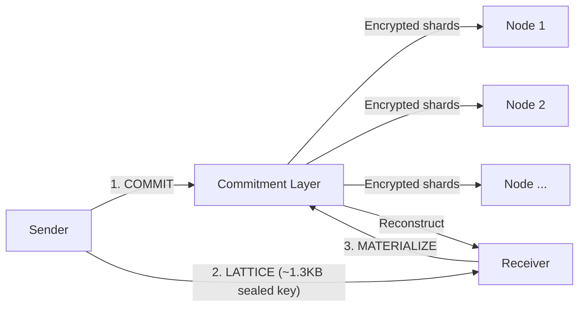
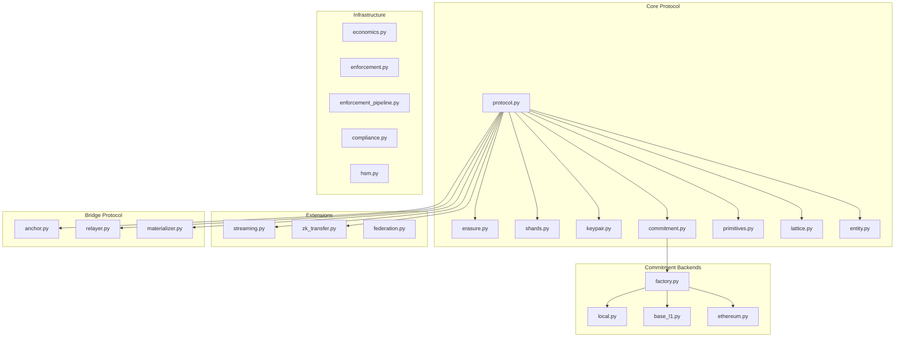
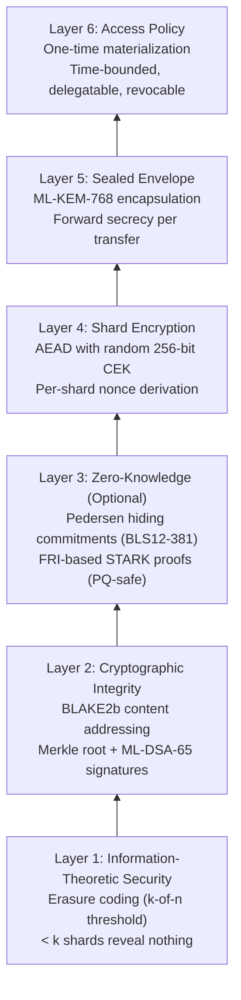

<div align="center">

# Entanglement Transfer Protocol

## A Post-Quantum Cryptographic Data Transfer Protocol

> *"Don't move the data. Transfer the proof. Reconstruct the truth."*

[]()
[]()
[]()
[]()
[]()
[](CLAUDE.md)
[](.cursorrules)

</div>

---

## Visuals

Diagrams of LTP, GSX DAG, GSX-DB, and the ecosystem atlas live in [`docs/visuals/`](docs/visuals/README.md) — each in three forms (inline Mermaid that renders on GitHub/GitBook, standalone HTML decks, and editable Mermaid/Excalidraw sources).

- [Visuals overview](docs/visuals/README.md) — inline-rendered Mermaid diagrams
- [LTP presentation](docs/visuals/ltp.html), [GSX DAG presentation](docs/visuals/gsx-dag.html), [GSX DB presentation](docs/visuals/gsx-db.html)
- [GSX Ecosystem Atlas](docs/visuals/gsx-ecosystem-atlas.html), [Visual index](docs/visuals/index.html)
- Mermaid sources: [LTP](docs/visuals/mermaid/ltp.md) · [GSX DAG](docs/visuals/mermaid/gsx-dag.md) · [GSX DB](docs/visuals/mermaid/gsx-db.md)
- Excalidraw sources: [LTP](docs/visuals/excalidraw/ltp.excalidraw) · [GSX DAG](docs/visuals/excalidraw/gsx-dag.excalidraw) · [GSX DB](docs/visuals/excalidraw/gsx-db.excalidraw)

## The Problem

Every existing protocol -- TCP/IP, HTTP, FTP, QUIC -- operates on the same
foundational assumption: **data is a payload that must travel from Point A to
Point B.** This chains us to three unsolvable constraints:

1. **Latency** -- bound by the speed of light and routing hops
2. **Geography** -- further = slower, always
3. **Compute** -- larger payloads demand more processing at both ends

ETP rejects this assumption. Data transfer is not about moving bits. It is about
transferring the *ability to reconstruct* a deterministic output at a destination,
verified by an immutable commitment.

## Three-Phase Protocol



| Phase | Operation | What Happens |
|-------|-----------|-------------|
| **COMMIT** | Sender commits entity | Erasure encode, encrypt shards with random CEK, distribute to nodes, append to Merkle log |
| **LATTICE** | Sender seals key to receiver | ML-KEM-768 sealed envelope (~1.3KB) containing entity_id + CEK + commitment reference |
| **MATERIALIZE** | Receiver reconstructs entity | Unseal key, verify commitment, fetch k-of-n shards, decrypt, decode, verify integrity |

The entity is never serialized and shipped as a monolithic payload. It is
**committed, proved, and reconstructed**.

## Core Guarantees

| Property | Guarantee | Mechanism |
|----------|-----------|-----------|
| O(1) transfer path | Sender-to-receiver carries ~1.3KB regardless of entity size | ML-KEM sealed lattice key |
| Immutability | Committed entities cannot be altered | Append-only Merkle log with ML-DSA-65 signatures |
| Threshold secrecy | < k shards reveal nothing about the entity | Information-theoretic security via erasure coding |
| Non-repudiation | Sender cannot deny having committed an entity | ML-DSA-65 signatures on commitment records |
| Post-quantum security | Resistant to quantum computer attacks | ML-KEM-768 (FIPS 203) + ML-DSA-65 (FIPS 204) |
| Forward secrecy | Compromising one transfer doesn't compromise others | Fresh ML-KEM encapsulation per transfer |

## Four Pillars

| Pillar | Implementation | Status |
|--------|---------------|--------|
| **Post-Quantum Cryptography** | ML-KEM-768/1024 (FIPS 203) + ML-DSA-65/87 (FIPS 204) + XChaCha20-Poly1305 | Active — real crypto, Level 3 + Level 5 |
| **Lattice Transfer Protocol** | 3-phase lifecycle with erasure coding, Merkle audit log, threshold reconstruction | Complete |
| **Dual-Lane Hashing** | SHA3-256 (canonical/on-chain) + BLAKE3-256 (internal/performance) | Enforced separation |
| **On-Chain Settlement** | LTPAnchorRegistry v6 with UUPS proxy + MultiSig + Timelock governance | Deployed on GSX Testnet + Base Sepolia |

## GSX Stack Alignment

LTP is the transfer and attestation layer for the GSX stack. `gsx-dag` owns DAG
ordering and validator-ring consensus; `gsx-db` owns the canonical EVM/Move
state substrate and emits the state roots that LTP anchors and attests.

| Layer | Repository | LTP Integration |
|-------|------------|-----------------|
| Transfer + attestation | `gsx-lattice-protocol` | COMMIT/LATTICE/MATERIALIZE, gateway VM, `LTPAnchorRegistry` |
| Consensus + ordering | `gsx-dag` | Consumes LTP corridor attestations through `crates/gsx-ltp` |
| State substrate | `gsx-db` | Produces state roots and anchors through `gsxdb-bridge` / `gsxdb-state` |

See [GSX DAG and GSX-DB Integration](docs/design-decisions/GSX_DAG_DB_INTEGRATION.md)
for the current cross-repo boundary.

The Python wire-compatible mirror of `gsx-dag/crates/gsx-ltp` lives in
[`src/ltp/corridor/`](src/ltp/corridor): 7-of-9 corridor attestation,
Commitment-Node DA SLA, cross-chain DID rotation statement, and the
length-prefixed SHA3-256 domain digest the DAG L1 signs over. Digest parity
against the Rust reference is locked in `tests/corridor/test_digest_parity.py`.

## Implementation Reality

| Area | Runtime Truth | Details |
|------|--------------|---------|
| **PQC (ML-KEM / ML-DSA / AEAD)** | Real — `pqcrypto` + `pynacl` | `assert_real_crypto()` at import; no PoC fallback |
| **ZK Proofs (STARK)** | Real — FRI over Goldilocks field | Default backend; ~10KB proofs with Merkle commitments |
| **ZK Proofs (Pedersen/Sigma)** | Real — BLS12-381 via `py_ecc` | Pedersen commitments + Schnorr/Sigma protocol (160B proofs) |
| **VDF (Wesolowski)** | Real — RSA group repeated squaring | Miller-Rabin k=40; O(1) verification with `pi^l * x^r == y` |
| **VDF (Hash-chain)** | Real — SHA3-256 iterative | PQ-safe alternative with checkpoint proofs |
| **Bridge Provers (STARK/SP1/R0)** | Real — FRI-based STARK | Mock modes delegate to real STARK prover |
| **Federation Signatures** | Real — ML-DSA `verify_sth()` | No hash-based simulation |
| **On-chain Anchoring** | Real — AnchorClient + web3.py | Circuit breaker, rate limiter, fail-fast config verification |
| **gRPC Transport** | Real — mTLS when configured | `NodeClient` uses `secure_channel`; fail-fast on TLS errors |
| **Gateway (REST)** | Real — JWT (ML-DSA-65) + rate limiting | FastAPI with Prometheus metrics |
| **HSM Custody** | Real boundary — sentinels for dk/sk | `hsm_sign()` / `hsm_decaps()` route through HSM; no plaintext leak |
| **Ethereum Backend** | Real when RPC configured | Fail-closed; no silent fallback to simulation in real mode |
| **Base L1 Backend** | Local simulation for testing | Production requires deployed chain infrastructure |
| **GSX-DAG Boundary** | External Rust L1 | DAG ordering and validator-ring consensus live in `gsx-dag` |
| **GSX-DB Boundary** | External Rust substrate | State mutation, OCC, state roots, recovery, and L2 sync live in `gsx-db` |

## What's Implemented

| Capability | Status | Module |
|------------|--------|--------|
| Three-phase protocol (COMMIT/LATTICE/MATERIALIZE) | Done | `protocol.py` |
| Erasure coding (Reed-Solomon GF(256)) | Done | `erasure.py` |
| AEAD shard encryption (CEK per entity) | Done | `shards.py` |
| ML-KEM-768 sealed envelope | Done | `keypair.py` |
| ML-DSA-65 commitment signatures | Done | `primitives.py` |
| Append-only Merkle commitment log | Done | `commitment.py` |
| Pluggable backends (Local, Base L1, Ethereum L2) | Done | `backends/` |
| Cross-chain bridge (L1Anchor, Relayer, L2Materializer) | Done | `bridge/` |
| Cross-deployment federation | Done | `federation.py` |
| Chunked streaming with backpressure | Done | `streaming.py` |
| ZK transfer mode (hiding commitments) | Done | `zk_transfer.py` |
| Economics engine (staking, slashing, rewards) | Done | `economics.py` |
| Enforcement pipeline (PDP, programmable slashing) | Done | `enforcement.py` |
| Compliance framework (9 control families) | Done | `compliance.py` |

## Architecture



## Security Stack



## Smart Contracts

### GSX Testnet (v5) — Chain ID `103115120`

| Contract | Address |
|----------|---------|
| UUPS Proxy (registry) | `0xB29d8BFF4973D1D7bcB10E32112EBB8fdd530bF4` |
| Implementation v5 | `0xADf01df5B6Bef8e37d253571ab6e21177aCb7796` |
| MultiSig (2-of-2) | `0x0106A79e9236009a05742B3fB1e3B7a52F44373D` |
| Timelock (60s delay) | `0x7C2665F7e68FE635ee8F10aa0130AEBC603a9Db8` |

### Base Sepolia (v6) — Chain ID `84532`

| Contract | Address |
|----------|---------|
| UUPS Proxy (registry) | `0x79eF1B7914f98C5C1404617449AB1f377c475996` |
| Implementation v6 | `0xb1Da18e714dD067f17d15C3Fe2EC2f39A5a3459E` |
| MultiSig (2-of-2) | `0x4c324c3c3475f58b67d3c879880D6c94eDC82E49` |
| Timelock (60s delay) | `0xc915740e35E38569E47f611eA5772Ff5278bc5Ae` |

**Governance chain:** MultiSig (2-of-2) → Timelock (60s) → Registry

**Deployment evolution:**
```
v1 (Mar 23)   Implementation only          No proxy, no governance
v2 (Mar 23)   + UUPS Proxy + MultiSig      Upgradeable, 2-of-2 control
v3 (Mar 23)   + TimelockController          Time-delayed governance
v4 (Mar 25)   Verified production deploy    84 Solidity + 1,167 Python tests
v5 (Mar 25)   Author attribution + v5      GSX Testnet production
v6 (Apr 14)   Base Sepolia L2 deployment   Bidirectional bridge
```

---

## Quick Start

```bash
# Clone and install
git clone https://github.com/GlobalSettlementNetwork/Entanglement-Transfer-Protocol.git
cd Entanglement-Transfer-Protocol
pip install -e ".[dev]"

# Run the demo
python run_trust_layer.py

# Run all tests
pytest tests/ -v

# Run Solidity tests (requires Foundry)
cd contracts && forge test -vvv
```

## Project Structure

```
Entanglement-Transfer-Protocol/
├── src/ltp/                    # Core protocol library (60+ modules)
│   ├── protocol.py             # Three-phase COMMIT/LATTICE/MATERIALIZE
│   ├── primitives.py           # ML-KEM-768, ML-DSA-65, AEAD, hashing
│   ├── commitment.py           # Merkle log, commitment network, node lifecycle
│   ├── erasure.py              # Reed-Solomon erasure coding over GF(256)
│   ├── shards.py               # AEAD shard encryption with CEK
│   ├── keypair.py              # ML-KEM sealed envelope (lattice key)
│   ├── lattice.py              # Lattice key construction
│   ├── entity.py               # Entity identity and shape analysis
│   ├── economics.py            # Staking, rewards, progressive slashing
│   ├── enforcement.py          # PDP proofs, programmable slashing, VDF audits
│   ├── enforcement_pipeline.py # Enforcement orchestration
│   ├── compliance.py           # 9-family compliance framework
│   ├── federation.py           # Cross-deployment discovery and trust
│   ├── streaming.py            # Chunked streaming with backpressure
│   ├── zk_transfer.py          # ZK hiding commitments (Pedersen + STARK)
│   ├── hsm.py                  # HSM interface for key management
│   ├── anchor/                 # On-chain anchoring client
│   ├── backends/               # Local, BaseL1, Ethereum backends
│   ├── bridge/                 # Cross-chain bridge protocol
│   ├── dual_lane/              # SHA3/BLAKE3 lane separation
│   ├── merkle_log/             # RFC 6962 Merkle tree + proofs
│   ├── network/                # gRPC client/server (7 RPCs)
│   ├── storage/                # SQLite (WAL), filesystem, memory stores
│   └── verify/                 # Verification SDK
│
├── contracts/
│   ├── src/
│   │   ├── LTPAnchorRegistry.sol      # On-chain anchor registry (UUPS)
│   │   ├── LTPMultiSig.sol            # N-of-M multi-signature wallet
│   │   └── interfaces/
│   │       └── ILTPAnchorRegistry.sol  # Registry interface
│   ├── test/
│   │   ├── LTPAnchorRegistry.t.sol    # 63 unit/integration tests
│   │   └── FormalVerification.t.sol   # 21 fuzz/invariant/parity tests
│   └── script/
│       ├── Deploy.s.sol               # Local deployment
│       ├── DeployTestnet.s.sol        # GSX Testnet deployment
│       ├── DeployMainnet.s.sol        # Production deployment (configurable)
│       └── UpgradeV4.s.sol            # Governance-controlled UUPS upgrade
│
├── tests/                      # 2,600+ Python tests across 114 files
├── docs/                       # Protocol documentation
│   ├── WHITEPAPER.md           # Full protocol specification
│   └── ...                     # See docs/README.md for index
├── pyproject.toml              # Package configuration
├── CHANGELOG.md                # Version history
├── CONTRIBUTING.md             # Contribution guidelines
├── SECURITY.md                 # Security policy
└── LICENSE                     # MIT License
```

## Documentation

See [docs/README.md](docs/README.md) for the full documentation index.

| Document | Description |
|----------|-------------|
| [Whitepaper](docs/WHITEPAPER.md) | Full protocol specification |
| [Architecture](docs/design-decisions/ARCHITECTURE.md) | System components and data flow |
| [Visuals](docs/visuals/README.md) | Inline-Mermaid diagrams (LTP, GSX DAG, GSX-DB, anchor lifecycle, trust boundary, DKG) |
| [GSX DAG and GSX-DB Integration](docs/design-decisions/GSX_DAG_DB_INTEGRATION.md) | Cross-repo boundary with the DAG L1 and state substrate |
| [Production Roadmap](docs/plans/2026-05-11-production-roadmap.md) | Current milestones (2026-05-11) |
| [Deployment Guide](docs/DEPLOYMENT_GUIDE.md) | Docker, Kubernetes, CI/CD |
| [Bridge MVP](docs/bridge-mvp-scope.md) | Cross-chain bridge scope |
| [Security Review](docs/design-decisions/Security/SECURITY_REVIEW-2-24-2026.md) | Formal security analysis |

## Test Coverage

| Category | Count |
|----------|-------|
| Python tests | 2,600+ |
| Solidity tests | 188 |
| ZK proof tests (EC + STARK) | 59 |
| Adversarial/attack tests | 56 |
| Security audit tests | 24 findings verified |
| Negative-path transport tests | 14 |
| State machine exhaustive (36 transition pairs) | Verified |
| Storage backend parametrized | 3 backends x 14 methods |
| gRPC round-trip (real servers) | 14 tests |
| Contract integration (anvil) | 17 tests |
| Fuzz runs (per test) | 256 iterations |
| Invariant tests | 256 runs x 3,840 calls each |
| **Total** | **2,800+** |

```bash
# Run Python tests
pip install -e ".[dev]"
pytest tests/ -v

# Run Solidity tests
cd contracts && forge test -vvv
```

## Key Properties

- **Constant-bandwidth sealed keys:** ~1,400 bytes O(1), independent of payload size
- **FIPS-compliant settlement:** SHA3-256 canonical hashing on all on-chain paths
- **No simulations:** Real PQC mandatory at import via `assert_real_crypto()`; real FRI-based STARK; real Wesolowski VDF
- **Python↔Solidity parity:** Identical accept/reject for all validation rules
- **HSM-safe key custody:** `KeyPair.generate(hsm=...)` keeps private keys in HSM boundary — sentinel dk/sk, operations via `hsm_sign()`/`hsm_decaps()`
- **Fail-closed infrastructure:** AnchorClient circuit breaker + rate limiter + `verify_live_configuration()` — no silent degradation

## Contributing

See [CONTRIBUTING.md](CONTRIBUTING.md) for development setup and guidelines.

## Security

See [SECURITY.md](SECURITY.md) for reporting vulnerabilities.

## License

MIT License. See [LICENSE](LICENSE).
