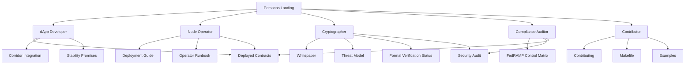

# Lattice Transfer Protocol — Documentation

Post-quantum cryptographic data transfer with on-chain anchors. This index
routes you to the right document in one click; if you can't tell what
you're looking for yet, start with the persona pages.

## Who are you?

| You are… | Start here |
|---|---|
| **dApp developer** building on top of LTP anchors | [→ dApp Developer](personas/dapp-developer.md) |
| **Node operator** running a node, gateway, or corridor super-node | [→ Node Operator](personas/node-operator.md) |
| **Cryptographer** reviewing the protocol or the proofs | [→ Cryptographer](personas/cryptographer.md) |
| **Compliance auditor** verifying FedRAMP / third-party audit | [→ Compliance Auditor](personas/compliance-auditor.md) |
| **Contributor** sending a PR or filing a bug | [→ Contributor](personas/contributor.md) |

See [personas/README.md](personas/README.md) for the rationale and the
Diátaxis quadrant model.

## Quick start

New to LTP? Read in this order:

1. **[CONTRIBUTING.md](../CONTRIBUTING.md)** — clone, install, run the test
   suite (~10 minutes)
2. **[WHITEPAPER.md](WHITEPAPER.md)** — three-phase protocol design
3. **[visuals/README.md](visuals/README.md)** — Mermaid + HTML decks for
   LTP, SUWAPPU DAG, SUWAPPU-DB, and the ecosystem atlas
4. **[CORRIDOR_INTEGRATION.md](CORRIDOR_INTEGRATION.md)** — wire format
5. **[DEPLOYED_CONTRACTS.md](DEPLOYED_CONTRACTS.md)** — current registry
   addresses on SUWAPPU Testnet and Base Sepolia

## Visuals

- [Visuals overview (inline Mermaid)](visuals/README.md)
- Presentations: [LTP](visuals/ltp.html) · [SUWAPPU DAG](visuals/suwappu-dag.html) · [SUWAPPU DB](visuals/suwappu-db.html) · [Ecosystem Atlas](visuals/suwappu-ecosystem-atlas.html) · [Visual index](visuals/index.html)
- Mermaid sources: [LTP](visuals/mermaid/ltp.md) · [SUWAPPU DAG](visuals/mermaid/suwappu-dag.md) · [SUWAPPU DB](visuals/mermaid/suwappu-db.md)
- Excalidraw sources: [LTP](visuals/excalidraw/ltp.excalidraw) · [SUWAPPU DAG](visuals/excalidraw/suwappu-dag.excalidraw) · [SUWAPPU DB](visuals/excalidraw/suwappu-db.excalidraw)

## Index by topic

| Category | Document | Description |
|---|---|---|
| **Getting Started** | [Contributing](../CONTRIBUTING.md) | Development setup, code style, PR workflow |
| | [Code of Conduct](../CODE_OF_CONDUCT.md) | Contributor Covenant 2.1 |
| | [Changelog](../CHANGELOG.md) | Version history v1.0.0 through v5.0.0 |
| | [Stability Promises](STABILITY_PROMISES.md) | What we will and won't break across versions |
| | [Security Policy](../SECURITY.md) | Vulnerability reporting and scope |
| **Specification** | [Whitepaper](WHITEPAPER.md) | Full protocol design — three-phase COMMIT / LATTICE / MATERIALIZE |
| | [Threat Model](THREAT_MODEL.md) | Adversary capabilities and invariants |
| | [Formal Verification Status](FORMAL_VERIFICATION_STATUS.md) | What's machine-checked vs paper-proven |
| **Architecture** | [Architecture](design-decisions/ARCHITECTURE.md) | System components, data flow, security layers |
| | [SUWAPPU DAG / SUWAPPU-DB Integration](design-decisions/SUWAPPU_DAG_DB_INTEGRATION.md) | Cross-repo boundary with the DAG L1 and state substrate |
| | [Corridor Integration](CORRIDOR_INTEGRATION.md) | Wire format and ABI surface |
| | [Streaming Protocol](design-decisions/STREAMING_PROTOCOL.md) | Chunked streaming, bandwidth amortization, backpressure |
| | [ZK Transfer Mode](design-decisions/ZK_TRANSFER_MODE.md) | Hiding commitments, Groth16 proofs |
| | [Enforcement Mechanisms](design-decisions/ENFORCEMENT_MECHANISMS.md) | PDP proofs, programmable slashing |
| | [Cross-Deployment Federation](design-decisions/CROSS_DEPLOYMENT_FEDERATION.md) | Network discovery, trust levels, federation |
| | [Commitment Network Options](design-decisions/COMMITMENT_NETWORK_OPTIONS.md) | Custom L1 vs Ethereum L1/L2 analysis |
| | [On-Chain PQ Verification](design-decisions/PQ_ONCHAIN_VERIFICATION.md) | Why ML-DSA can't be verified on-chain today, and the EIP/ERC path out |
| | [Standards Work](eips/README.md) | Draft ERCs and prepared EIP feedback |
| | [Deferred-Token Architecture](economics/DEFERRED_TOKEN_ARCHITECTURE.md) | Stablecoin-native security, no premined token |
| | [Validator Compute Incentives](economics/VALIDATOR_COMPUTE_INCENTIVES.md) | Compute in, proofs up, stablecoins out — the operator payment loop |
| | [Inference Revenue](economics/INFERENCE_REVENUE.md) | Selling metered model inference in stablecoins — the demand side |
| **Operations** | [Deployment Guide](DEPLOYMENT_GUIDE.md) | Docker, Kubernetes, CI/CD, key management |
| | [Operator Runbook](OPERATOR_RUNBOOK.md) | Day-2 operations, key rotation, on-call |
| | [Bridge MVP Scope](bridge-mvp-scope.md) | L1-L2 cross-chain bridge scope |
| | [Deployed Contracts](DEPLOYED_CONTRACTS.md) | Current registry addresses and governance topology |
| **Compliance** | [FedRAMP High Readiness](compliance/fedramp-high/README.md) | System boundary, control matrix, SSP narratives |
| **Security** | [Security Audit (2026-05-15)](security/audits/internal/SECURITY_AUDIT_2026-05-15.md) | Most recent independent audit |
| | [Security Review (2026-02-24)](security/audits/internal/SECURITY_REVIEW-2-24-2026.md) | Formal security review |
| | [Shard Exposure Analysis](security/audits/internal/001-lattice-key-shard-exposure.md) | Attack chain analysis and Option A-D comparison |
| | [Formal Protocol Analysis](formal/ANALYSIS.md) | Verifpal symbolic analysis + recorded run |

## Document relationships

## Examples

Runnable examples live in [`examples/`](../examples/) and double as
tutorial content. Start with [`quickstart.py`](../examples/quickstart.py)
and [`bridge_transfer.py`](../examples/bridge_transfer.py).
