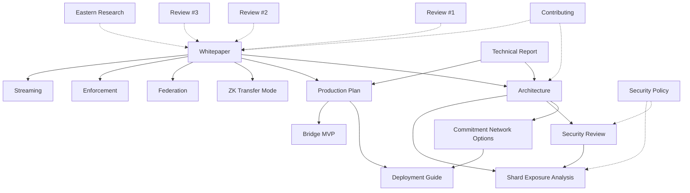

# Documentation Index

## Overview

The Entanglement Transfer Protocol documentation is organized into seven categories.

## Visuals

Inline Mermaid diagrams, standalone HTML decks, and editable Mermaid/Excalidraw sources live in [`docs/visuals/`](visuals/README.md).

- [Visuals overview (inline Mermaid)](visuals/README.md)
- Presentations: [LTP](visuals/ltp.html) · [GSX DAG](visuals/gsx-dag.html) · [GSX DB](visuals/gsx-db.html) · [Ecosystem Atlas](visuals/gsx-ecosystem-atlas.html) · [Visual index](visuals/index.html)
- Mermaid sources: [LTP](visuals/mermaid/ltp.md) · [GSX DAG](visuals/mermaid/gsx-dag.md) · [GSX DB](visuals/mermaid/gsx-db.md)
- Excalidraw sources: [LTP](visuals/excalidraw/ltp.excalidraw) · [GSX DAG](visuals/excalidraw/gsx-dag.excalidraw) · [GSX DB](visuals/excalidraw/gsx-db.excalidraw)

| Category | Document | Description |
|----------|----------|-------------|
| **Getting Started** | [Contributing](../CONTRIBUTING.md) | Development setup, code style, PR workflow |
| | [Changelog](../CHANGELOG.md) | Version history v1.0.0 through v5.0.0 |
| | [Security Policy](../SECURITY.md) | Vulnerability reporting and contract security scope |
| **Specification** | [Whitepaper](WHITEPAPER.md) | Full protocol design — three-phase COMMIT/LATTICE/MATERIALIZE |
| | [Visuals](visuals/README.md) | Inline-Mermaid diagrams + HTML decks + editable sources |
| **Architecture** | [Architecture](design-decisions/ARCHITECTURE.md) | System components, data flow, security layers |
| | [GSX DAG and GSX-DB Integration](design-decisions/GSX_DAG_DB_INTEGRATION.md) | Cross-repo boundary with the DAG L1 and state substrate |
| | [Commitment Network Options](design-decisions/COMMITMENT_NETWORK_OPTIONS.md) | Custom L1 vs Ethereum L1/L2 analysis |
| | [Streaming Protocol](design-decisions/STREAMING_PROTOCOL.md) | Chunked streaming, bandwidth amortization, backpressure |
| | [Enforcement Mechanisms](design-decisions/ENFORCEMENT_MECHANISMS.md) | PDP proofs, programmable slashing, progressive decentralization |
| | [Cross-Deployment Federation](design-decisions/CROSS_DEPLOYMENT_FEDERATION.md) | Network discovery, trust levels, cross-network materialization |
| | [ZK Transfer Mode](design-decisions/ZK_TRANSFER_MODE.md) | Hiding commitments, Groth16 proofs, post-quantum upgrade path |
| **Operations** | [Production Plan](PRODUCTION_PLAN.md) | PoC to production roadmap — 7 phases, 14 weeks |
| | [Deployment Guide](DEPLOYMENT_GUIDE.md) | Docker, Kubernetes, CI/CD, key management, monitoring |
| | [Bridge MVP](bridge-mvp-scope.md) | L1-L2 cross-chain bridge scope and components |
| **Compliance** | [FedRAMP High Readiness](compliance/fedramp-high/README.md) | System boundary, control matrix, SSP narratives, and release evidence gates |
| **Security** | [Security Review](design-decisions/Security/SECURITY_REVIEW-2-24-2026.md) | Formal security review (2026-02-24) |
| | [Shard Exposure Analysis](design-decisions/Security/001-lattice-key-shard-exposure.md) | Attack chain analysis and Option A-D comparison |
| **Reviews** | [Review #1](design-decisions/Reviews/001/001-Formal-Whitepaper-Review.md) | Formal whitepaper review |
| | [Review #2](design-decisions/Reviews/002/002-Formal-Whitepaper-Review.md) | Formal whitepaper review |
| | [Review #3](design-decisions/Reviews/003/003-Formal-Whitepaper-review.md) | Formal whitepaper review |
| | [Eastern Research Landscape](design-decisions/Reviews/004/004-Eastern-Research-Landscape.md) | Asian blockchain research landscape for ETP expansion |

## Document Relationships

## Quick Start

New to ETP? Read in this order:

1. **[Contributing](../CONTRIBUTING.md)** — Clone, install, run tests
2. **[Whitepaper](WHITEPAPER.md)** — Understand the core protocol
3. **[Architecture](design-decisions/ARCHITECTURE.md)** — See how it's built
4. **[Visuals](visuals/README.md)** — Inline diagrams of LTP, GSX DAG, and GSX-DB
5. **[Security Review](design-decisions/Security/SECURITY_REVIEW-2-24-2026.md)** — Understand the threat model
6. **[Production Roadmap](plans/2026-05-11-production-roadmap.md)** — See the current milestones
