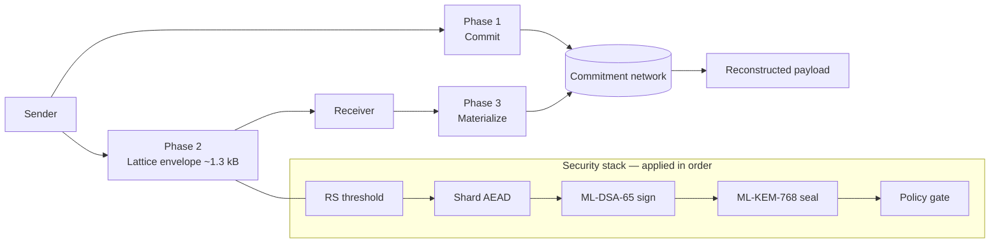
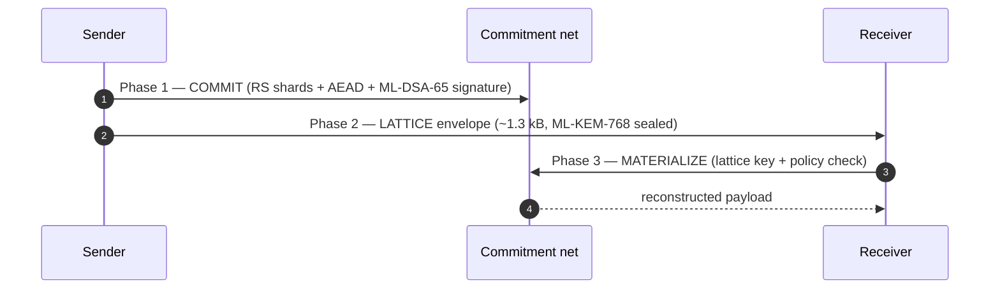
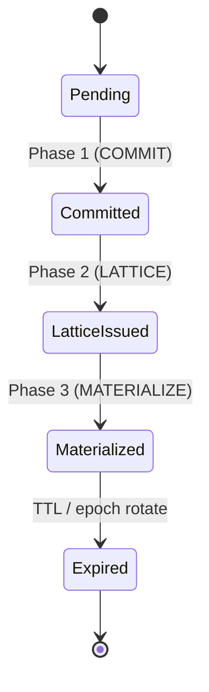
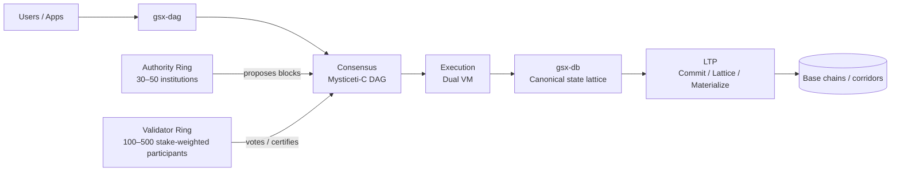
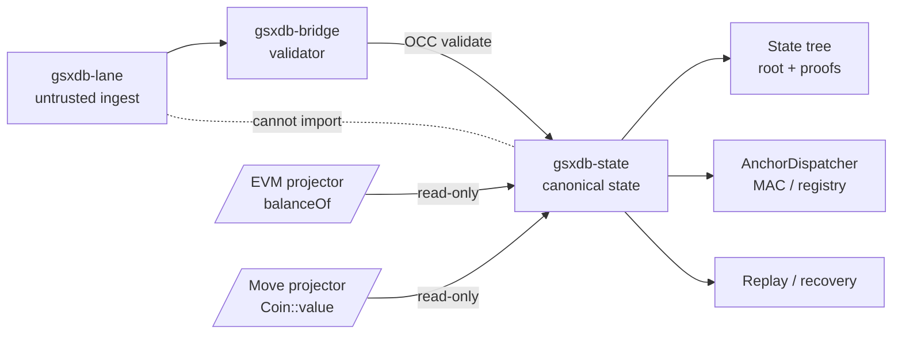
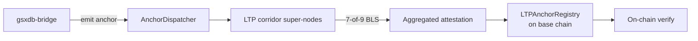
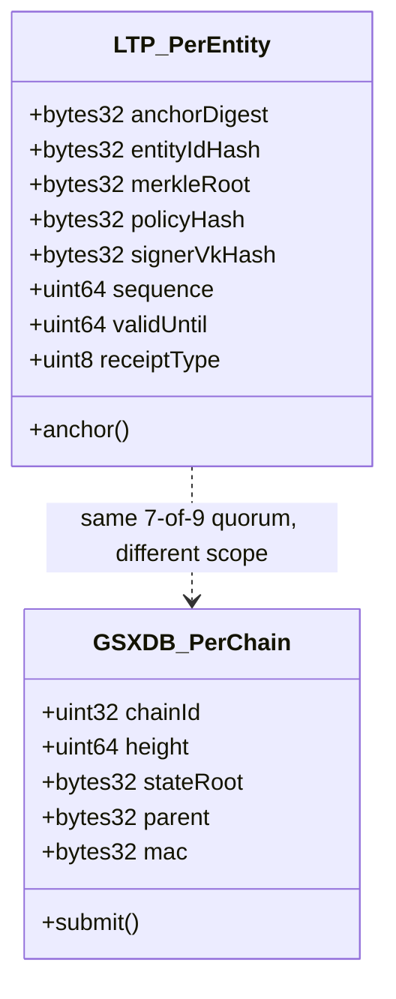
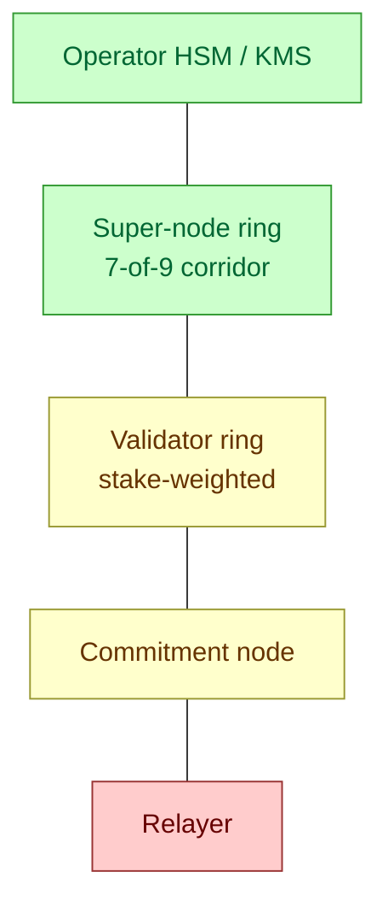
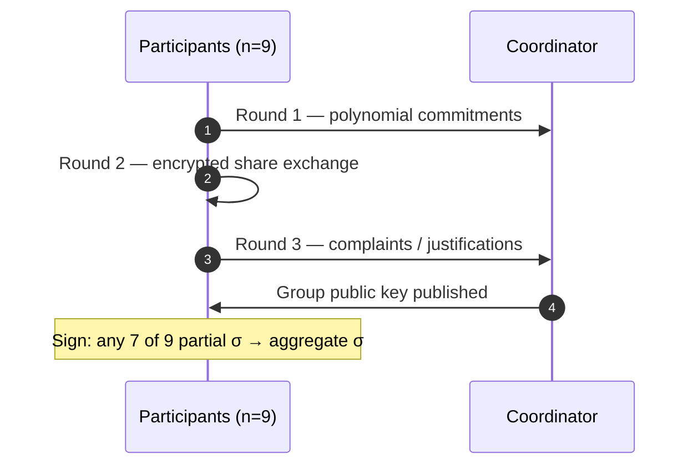
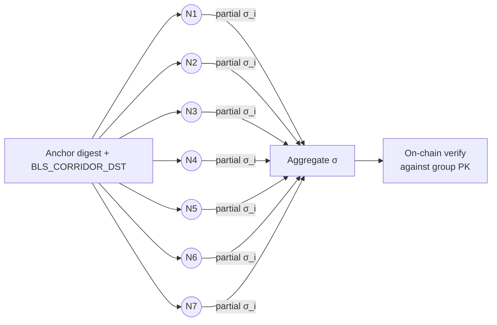

# GSX Stack Visuals

Diagrams of the LTP transfer flow, the GSX stack it sits inside, and the protocol details that auditors and reviewers tend to ask about. Every inline Mermaid block renders natively on GitHub and GitBook (no plugin). Bare sources live under `mermaid/` and `excalidraw/` for remixing in [Mermaid Live](https://mermaid.live) or [Excalidraw](https://excalidraw.com).

## Index

| # | Diagram | Audience | Type |
|---|---------|----------|------|
| 1 | [LTP — Three-Phase Transfer](#ltp--three-phase-transfer) | whitepaper reader | flowchart |
| 2 | [LTP 3-phase handshake (over time)](#ltp-3-phase-handshake-over-time) | whitepaper reader | sequence |
| 3 | [Entity lifecycle](#entity-lifecycle) | whitepaper reader | state |
| 4 | [GSX DAG — Layer 1](#gsx-dag--layer-1) | architect | flowchart |
| 5 | [GSX DB — Canonical State Substrate](#gsx-db--canonical-state-substrate) | architect | flowchart |
| 6 | [End-to-end anchor lifecycle](#end-to-end-anchor-lifecycle) | auditor | flowchart |
| 7 | [LTPAnchorRegistry schemas](#ltpanchorregistry-schemas) | reviewer | class |
| 8 | [Trust boundary](#trust-boundary) | auditor + operator | flowchart |
| 9 | [DKG ceremony + threshold BLS](#dkg-ceremony--threshold-bls) | reviewer | sequence |
| 10 | [Corridor 7-of-9 BLS quorum](#corridor-7-of-9-bls-quorum) | reviewer | flowchart |
| 11 | [GSX Ecosystem Atlas](#gsx-ecosystem-atlas) | exec summary | HTML deck |

## LTP — Three-Phase Transfer

LTP separates *what was sent* (Phase 1: COMMIT to the commitment network), *how to read it* (Phase 2: LATTICE envelope, ~1.3 kB, ML-KEM-768 + ML-DSA-65 over SHA3-256, optional ZK mode), and *who can reconstruct it* (Phase 3: MATERIALIZE from the network using the lattice key). The security stack is applied in order: every shard is RS-coded, encrypted with AEAD, signed with ML-DSA-65, sealed with ML-KEM-768, and gated by policy.

- Standalone presentation: [`ltp.html`](./ltp.html)
- Mermaid source: [`mermaid/ltp.md`](./mermaid/ltp.md)
- Excalidraw source: [`excalidraw/ltp.excalidraw`](./excalidraw/ltp.excalidraw)

## LTP 3-phase handshake (over time)

The same protocol viewed as a temporal sequence between Sender, Commitment network, and Receiver. The phases overlap in time — the lattice envelope can be delivered to the receiver before the commitment write has fully propagated.

- Mermaid source: [`mermaid/handshake.md`](./mermaid/handshake.md)

## Entity lifecycle

An LTP entity transitions through five states. The forward arrows are the only legal transitions; you cannot un-commit, and you cannot materialize before Phase 2 delivers the lattice key.

- Mermaid source: [`mermaid/entity-lifecycle.md`](./mermaid/entity-lifecycle.md)

## GSX DAG — Layer 1

The DAG L1 owns certificate-DAG ordering (Mysticeti-C), validator-ring consensus, and dual-VM execution. The Authority Ring proposes blocks; the Validator Ring votes and certifies; together they secure consensus. LTP corridor super-nodes attest the state roots that GSX-DB emits after DAG ordering.

- Standalone presentation: [`gsx-dag.html`](./gsx-dag.html)
- Mermaid source: [`mermaid/gsx-dag.md`](./mermaid/gsx-dag.md)
- Excalidraw source: [`excalidraw/gsx-dag.excalidraw`](./excalidraw/gsx-dag.excalidraw)

## GSX DB — Canonical State Substrate

GSX-DB owns capability-gated state mutation. The `gsxdb-lane` ingest is untrusted and **cannot import** `gsxdb-state` directly — every write goes through the `gsxdb-bridge` validator under optimistic concurrency control (OCC). Read projections (EVM `balanceOf`, Move `Coin::value`) are pure, read-only views off the canonical lattice. Replay/recovery is a separate, idempotent path off the same state — it does not mutate.

- Standalone presentation: [`gsx-db.html`](./gsx-db.html)
- Mermaid source: [`mermaid/gsx-db.md`](./mermaid/gsx-db.md)
- Excalidraw source: [`excalidraw/gsx-db.excalidraw`](./excalidraw/gsx-db.excalidraw)

## End-to-end anchor lifecycle

How a GSX-DB state root becomes a verifiable on-chain anchor on a base chain. The `gsxdb-bridge` emits an anchor, the LTP corridor super-nodes form a 7-of-9 BLS attestation under `BLS_CORRIDOR_DST`, the aggregated signature is submitted to `LTPAnchorRegistry` on the destination chain, and any verifier can re-derive the digest.

- Mermaid source: [`mermaid/anchor-lifecycle.md`](./mermaid/anchor-lifecycle.md)

## LTPAnchorRegistry schemas

Two different contracts share the `LTPAnchorRegistry` name. The LTP-side contract anchors **per-entity** commitments (proof that a specific LTP entity was committed); the GSX-DB-side contract anchors **per-chain** state roots (proof that a chain's state advanced to a specific height). Both are co-signed by the same 7-of-9 corridor quorum.

- Source contracts: [`contracts/src/LTPAnchorRegistry.sol`](../../contracts/src/LTPAnchorRegistry.sol) (per-entity); `gsx-db/contracts/src/LTPAnchorRegistry.sol` (per-chain)
- Disambiguation table: [`design-decisions/GSX_DAG_DB_INTEGRATION.md`](../design-decisions/GSX_DAG_DB_INTEGRATION.md)
- Mermaid source: [`mermaid/anchor-registry.md`](./mermaid/anchor-registry.md)

## Trust boundary

Trust zones across the system. Green = trusted (controlled by the operator or quorum-elected); yellow = semi-trusted (incentive-aligned but verified); red = untrusted (assume hostile, all output validated).

- Threat model: [`THREAT_MODEL.md`](../THREAT_MODEL.md)
- FedRAMP trust boundary: [`compliance/fedramp-high/trust-boundary.md`](../compliance/fedramp-high/trust-boundary.md)
- Mermaid source: [`mermaid/trust-boundary.md`](./mermaid/trust-boundary.md)

## DKG ceremony + threshold BLS

How the 7-of-9 corridor key is generated and used. A distributed key generation (DKG) ceremony with three rounds produces a group public key with no single party knowing the private key; signing produces partial signatures from any 7 of 9 participants that aggregate into a single BLS signature.

- Specs: [`plans/2026-05-09-threshold-dkg-spec.md`](../plans/2026-05-09-threshold-dkg-spec.md), [`plans/2026-05-11-threshold-bls-signing-spec.md`](../plans/2026-05-11-threshold-bls-signing-spec.md)
- Mermaid source: [`mermaid/dkg-ceremony.md`](./mermaid/dkg-ceremony.md)

## Corridor 7-of-9 BLS quorum

The signing step in isolation. Any 7 of 9 super-nodes sign the anchor digest under `BLS_SIG_BLS12381G2_XMD:SHA-256_SSWU_RO_NUL_` (`BLS_CORRIDOR_DST`); the partial signatures aggregate to one constant-size BLS signature that a base-chain verifier can check against the group public key.

- DST constant: [`src/ltp/corridor/constants.py`](../../src/ltp/corridor/constants.py) (matches `gsx-dag/crates/gsx-crypto/src/bls.rs::BLS_DST`)
- Mermaid source: [`mermaid/corridor-quorum.md`](./mermaid/corridor-quorum.md)

## GSX Ecosystem Atlas

Big-picture map of how LTP, GSX DAG, and GSX-DB compose into a settlement-grade stack.

- Standalone presentation: [`gsx-ecosystem-atlas.html`](./gsx-ecosystem-atlas.html)
- Visual index entry point: [`index.html`](./index.html)

## Editing

The inline Mermaid blocks in this file are the **canonical source going forward**. The standalone HTML decks (`ltp.html`, `gsx-dag.html`, `gsx-db.html`, `gsx-ecosystem-atlas.html`, `index.html`) are historical snapshots from the initial deck export and are not auto-regenerated — if a diagram drifts, update the inline Mermaid here and the bare source under `mermaid/`, and only regenerate the HTML if the styled deck view is being actively used.

To change a diagram:

1. Edit `mermaid/<name>.md` and the matching inline block in this file together.
2. Paste the Mermaid into [Mermaid Live](https://mermaid.live) to confirm it renders; check the GitHub PR diff for the native render.
3. If the diagram semantics changed (not just labels), also update [`design-decisions/GSX_DAG_DB_INTEGRATION.md`](../design-decisions/GSX_DAG_DB_INTEGRATION.md) and any whitepaper or architecture section that references the same model.
