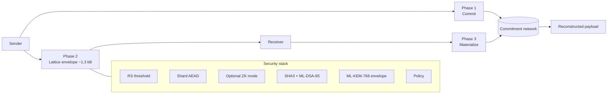
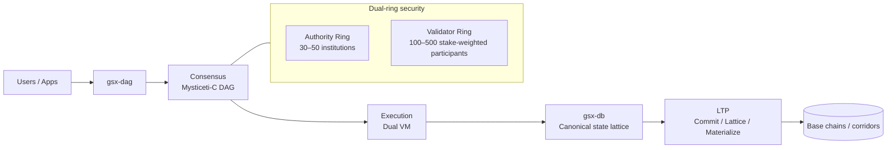
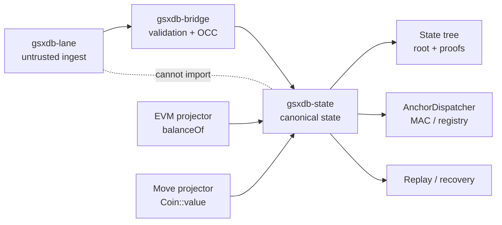

# GSX Stack Visuals

Diagrams of the LTP transfer flow and the GSX stack it sits inside. Every diagram below has three sources of truth in this directory:

- **inline Mermaid** in this file — renders on GitHub and GitBook with no plugin
- **standalone HTML presentation** (`*.html`) — open locally for the styled deck view
- **editable source** (`mermaid/*.md`, `excalidraw/*.excalidraw`) — drop into [Mermaid Live](https://mermaid.live) or [Excalidraw](https://excalidraw.com) to remix

## LTP — Three-Phase Transfer

LTP separates *what was sent* (Phase 1: COMMIT to the commitment network), *how to read it* (Phase 2: LATTICE envelope, ~1.3 kB, ML-KEM-768 + ML-DSA-65 over SHA3-256, optional ZK mode), and *who can reconstruct it* (Phase 3: MATERIALIZE from the network using the lattice key).

- Standalone presentation: [`ltp.html`](./ltp.html)
- Mermaid source: [`mermaid/ltp.md`](./mermaid/ltp.md)
- Excalidraw source: [`excalidraw/ltp.excalidraw`](./excalidraw/ltp.excalidraw)

## GSX DAG — Layer 1

The DAG L1 owns certificate-DAG ordering (Mysticeti-C), validator-ring consensus, and dual-VM execution. LTP corridor super-nodes attest the state roots that GSX-DB emits after DAG ordering.

- Standalone presentation: [`gsx-dag.html`](./gsx-dag.html)
- Mermaid source: [`mermaid/gsx-dag.md`](./mermaid/gsx-dag.md)
- Excalidraw source: [`excalidraw/gsx-dag.excalidraw`](./excalidraw/gsx-dag.excalidraw)

## GSX DB — Canonical State Substrate

GSX-DB owns capability-gated state mutation. The `gsxdb-lane` ingest is untrusted and cannot import `gsxdb-state` directly — every write goes through the `gsxdb-bridge` validator with OCC. Read projections (EVM `balanceOf`, Move `Coin::value`) are pure reads off the canonical lattice.

- Standalone presentation: [`gsx-db.html`](./gsx-db.html)
- Mermaid source: [`mermaid/gsx-db.md`](./mermaid/gsx-db.md)
- Excalidraw source: [`excalidraw/gsx-db.excalidraw`](./excalidraw/gsx-db.excalidraw)

## GSX Ecosystem Atlas

Big-picture map of how LTP, GSX DAG, and GSX-DB compose into a settlement-grade stack.

- Standalone presentation: [`gsx-ecosystem-atlas.html`](./gsx-ecosystem-atlas.html)
- Visual index entry point: [`index.html`](./index.html)

## Editing

The HTML decks are self-contained — open them in a browser to view; no build step. To change a diagram:

1. Edit `mermaid/<name>.md` or `excalidraw/<name>.excalidraw`.
2. Paste the Mermaid source into [Mermaid Live](https://mermaid.live) or load the `.excalidraw` file in Excalidraw to remix.
3. Update the embedded Mermaid block in this file so GitHub / GitBook stays in sync.
4. Regenerate the HTML deck (style + layout in `<name>.html` head; replace the diagram body) if the standalone view also changed.

If you change the diagram semantics, also update [`../design-decisions/GSX_DAG_DB_INTEGRATION.md`](../design-decisions/GSX_DAG_DB_INTEGRATION.md) so the cross-repo boundary docs stay consistent.
