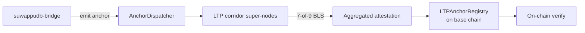

# End-to-end anchor lifecycle — Mermaid

```mermaid
flowchart LR
  DB[suwappudb-bridge] -->|emit anchor| Disp[AnchorDispatcher]
  Disp --> Corr[LTP corridor super-nodes]
  Corr -->|7-of-9 BLS| Agg[Aggregated attestation]
  Agg --> Reg[LTPAnchorRegistry<br/>on base chain]
  Reg --> Verify[On-chain verify]
```
