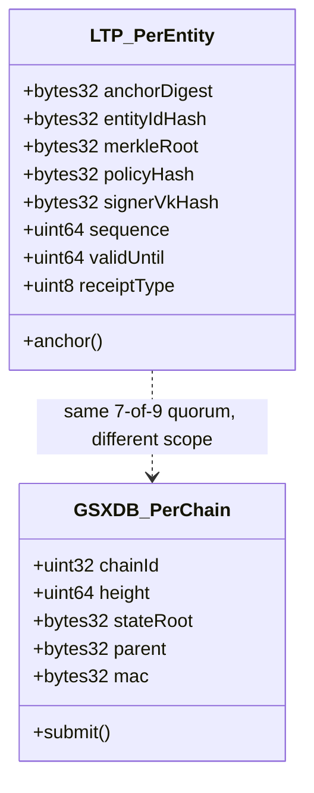

# LTPAnchorRegistry schemas — Mermaid

```mermaid
classDiagram
  class LTP_PerEntity {
    +bytes32 anchorDigest
    +bytes32 entityIdHash
    +bytes32 merkleRoot
    +bytes32 policyHash
    +bytes32 signerVkHash
    +uint64 sequence
    +uint64 validUntil
    +uint8 receiptType
    +anchor()
  }
  class GSXDB_PerChain {
    +uint32 chainId
    +uint64 height
    +bytes32 stateRoot
    +bytes32 parent
    +bytes32 mac
    +submit()
  }
  LTP_PerEntity ..> GSXDB_PerChain : same 7-of-9 quorum, different scope
```
