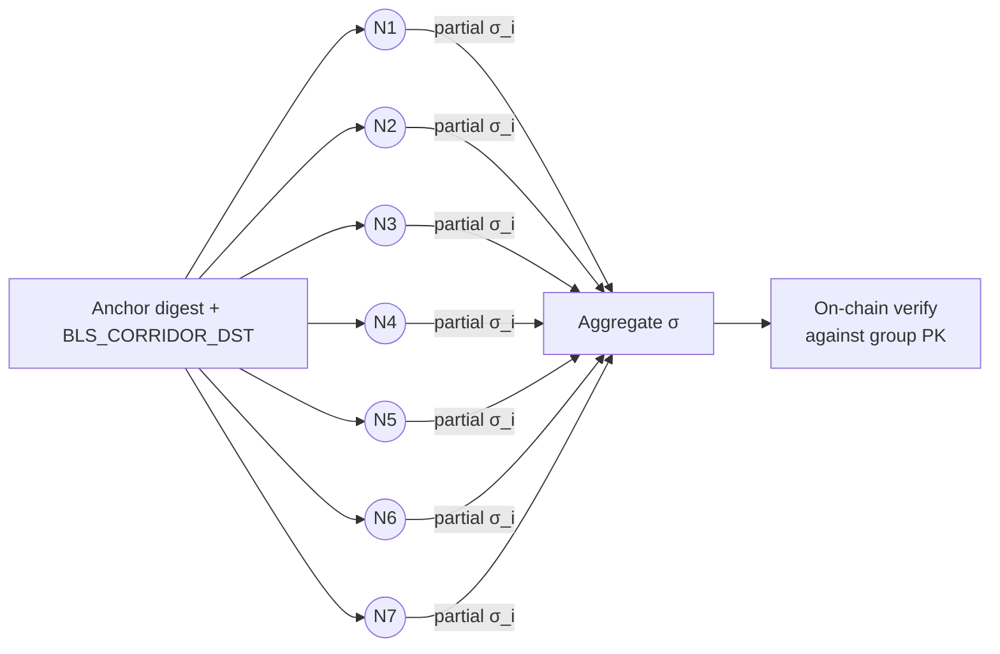

# Corridor 7-of-9 BLS quorum — Mermaid

```mermaid
flowchart LR
  Msg[Anchor digest + BLS_CORRIDOR_DST]
  Msg --> N1((N1)) & N2((N2)) & N3((N3)) & N4((N4)) & N5((N5)) & N6((N6)) & N7((N7))
  N1 & N2 & N3 & N4 & N5 & N6 & N7 -->|partial σ_i| Agg[Aggregate σ]
  Agg --> Verify[On-chain verify<br/>against group PK]
```
