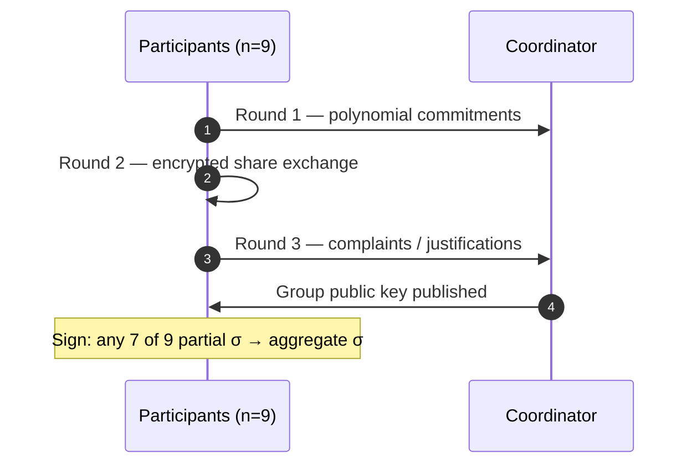

# DKG ceremony + threshold BLS — Mermaid

```mermaid
sequenceDiagram
  autonumber
  participant P as Participants (n=9)
  participant C as Coordinator
  P->>C: Round 1 — polynomial commitments
  P->>P: Round 2 — encrypted share exchange
  P->>C: Round 3 — complaints / justifications
  C->>P: Group public key published
  Note over P: Sign: any 7 of 9 partial σ → aggregate σ
```
