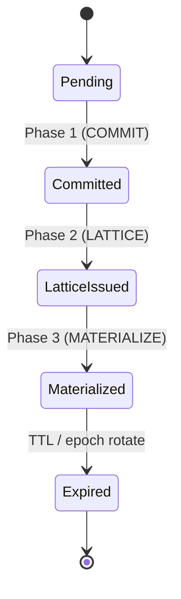

# Entity lifecycle — Mermaid

```mermaid
stateDiagram-v2
  [*] --> Pending
  Pending --> Committed: Phase 1 (COMMIT)
  Committed --> LatticeIssued: Phase 2 (LATTICE)
  LatticeIssued --> Materialized: Phase 3 (MATERIALIZE)
  Materialized --> Expired: TTL / epoch rotate
  Expired --> [*]
```
