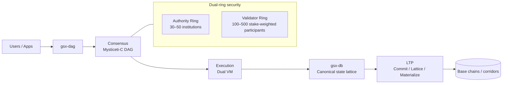

# GSX DAG — Mermaid

```mermaid
flowchart LR
  Users[Users / Apps] --> DAG[gsx-dag]
  DAG --> C[Consensus
Mysticeti-C DAG]
  C --> E[Execution
Dual VM]
  E --> DB[gsx-db
Canonical state lattice]
  DB --> LTP[LTP
Commit / Lattice / Materialize]
  LTP --> Corridors[(Base chains / corridors)]
  subgraph Rings[Dual-ring security]
    A[Authority Ring
30–50 institutions]
    V[Validator Ring
100–500 stake-weighted participants]
  end
  C --- Rings
```
