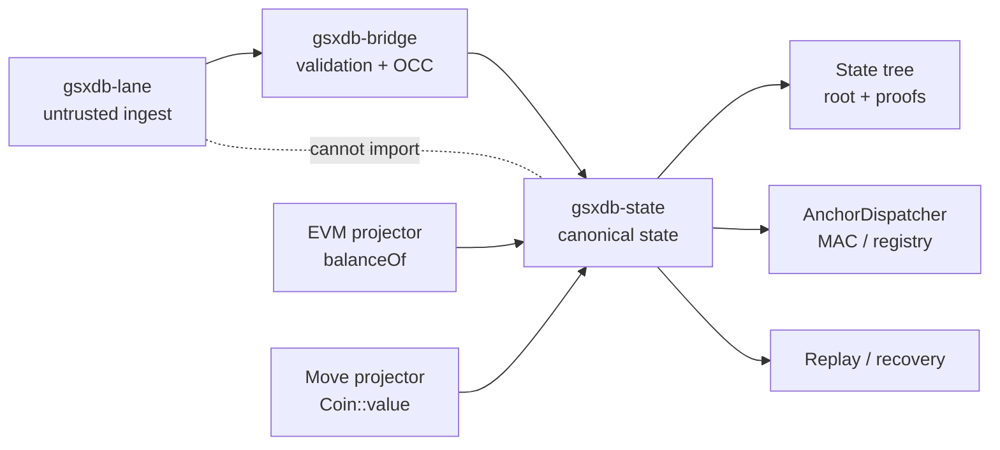

# GSX DB — Mermaid

```mermaid
flowchart LR
  Lane[gsxdb-lane
untrusted ingest] --> Bridge[gsxdb-bridge
validation + OCC]
  Bridge --> State[gsxdb-state
canonical state]
  Lane -. cannot import .- State
  State --> Tree[State tree
root + proofs]
  State --> Anchor[AnchorDispatcher
MAC / registry]
  State --> Replay[Replay / recovery]
  Read1[EVM projector
balanceOf] --> State
  Read2[Move projector
Coin::value] --> State
```
