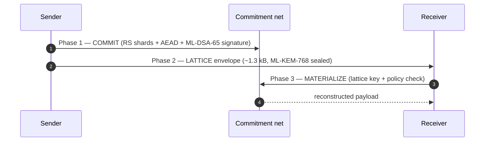

# LTP 3-phase handshake — Mermaid

```mermaid
sequenceDiagram
  autonumber
  participant S as Sender
  participant N as Commitment net
  participant R as Receiver
  S->>N: Phase 1 — COMMIT (RS shards + AEAD + ML-DSA-65 signature)
  S->>R: Phase 2 — LATTICE envelope (~1.3 kB, ML-KEM-768 sealed)
  R->>N: Phase 3 — MATERIALIZE (lattice key + policy check)
  N-->>R: reconstructed payload
```
