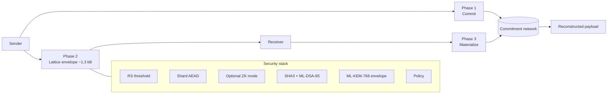

# LTP — Mermaid

```mermaid
flowchart LR
  Sender[Sender] --> Commit[Phase 1<br/>Commit]
  Commit --> Network[(Commitment network)]
  Sender --> Lattice[Phase 2<br/>Lattice envelope ~1.3 kB]
  Lattice --> Receiver[Receiver]
  Receiver --> Materialize[Phase 3<br/>Materialize]
  Materialize --> Network
  Network --> Output[Reconstructed payload]
  subgraph Security[Security stack]
    S1[RS threshold]
    S2[Shard AEAD]
    S3[Optional ZK mode]
    S4[SHA3 + ML-DSA-65]
    S5[ML-KEM-768 envelope]
    S6[Policy]
  end
  Lattice --- Security
```
