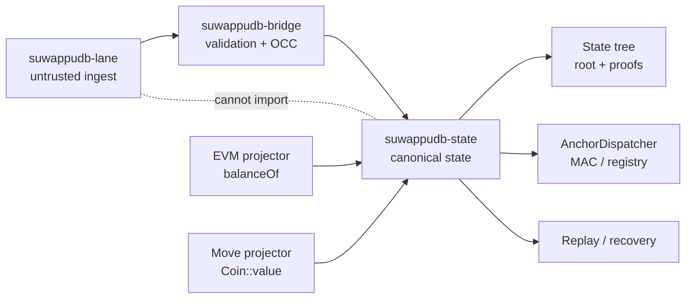

# SUWAPPU DB — Mermaid

```mermaid
flowchart LR
  Lane[suwappudb-lane<br/>untrusted ingest] --> Bridge[suwappudb-bridge<br/>validation + OCC]
  Bridge --> State[suwappudb-state<br/>canonical state]
  Lane -. cannot import .- State
  State --> Tree[State tree<br/>root + proofs]
  State --> Anchor[AnchorDispatcher<br/>MAC / registry]
  State --> Replay[Replay / recovery]
  Read1[EVM projector<br/>balanceOf] --> State
  Read2[Move projector<br/>Coin::value] --> State
```
