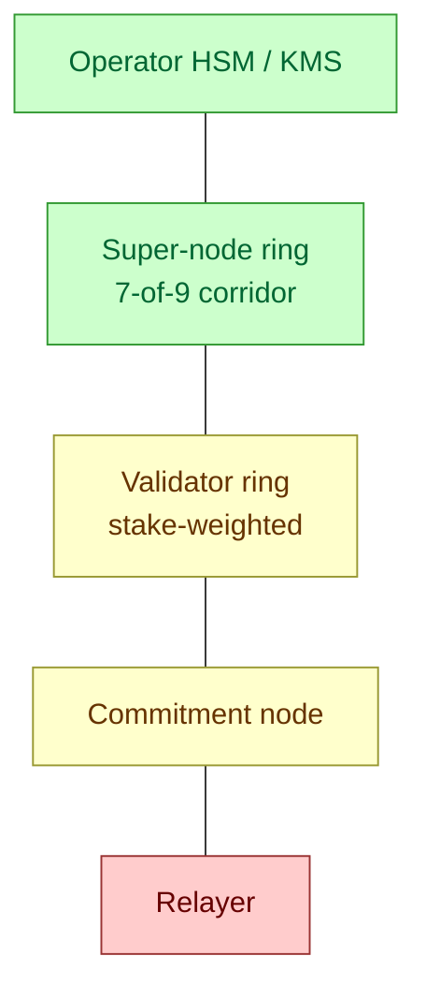

# Trust boundary — Mermaid

```mermaid
flowchart TB
  classDef trusted fill:#cfc,stroke:#393,color:#063
  classDef semi fill:#ffc,stroke:#993,color:#630
  classDef untrusted fill:#fcc,stroke:#933,color:#600
  Op[Operator HSM / KMS]:::trusted
  SN[Super-node ring<br/>7-of-9 corridor]:::trusted
  VR[Validator ring<br/>stake-weighted]:::semi
  CN[Commitment node]:::semi
  Rel[Relayer]:::untrusted
  Op --- SN
  SN --- VR
  VR --- CN
  CN --- Rel
```
